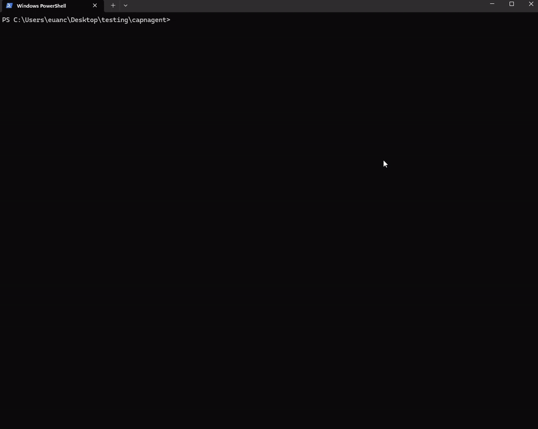

# capnagent

> **A public purple-team harness for MCP servers and AI-agent tool
> surfaces.** Documents adversarial scenarios against agent tool calls,
> writes the security claim in falsifiable form, and proves the defense
> holds (or breaks) with a runnable PoC and a signed denial receipt as
> evidence. Built on a Rust capability-token engine — macaroon-style,
> attenuable, revocable, audit-logged, ed25519 holder-of-key — wired
> through an MCP adapter that drops in front of any structurally-typed
> MCP client.

The thesis: prompt injection is a **confused-deputy attack**. Smarter
guardrails don't fix it; removing the deputy's ambient authority does.
The agent holds a capability that bounds what it CAN do; out-of-scope
calls are refused before the underlying tool surface sees them.



Clip above: `demo:llm-direct` — Claude Opus 4.7 agent driven by the
Anthropic SDK is asked to send a $30 wire **and** buy a USB-C cable.
Issued capability scopes the agent to `tool == "checkout.purchase"`.
Wire denied at the gate; cable proceeds; both decisions audit-logged.

## The purple-team corpus

The library is the engine. The **corpus** is the artifact —
[`docs/purple-team/`](docs/purple-team/) — a structured record of
attack scenarios run against capnagent, methodology blue-first
(falsifiable claims before attacks), with a runnable PoC and signed
receipt evidence per round.

| #  | Scenario                                        | Class                | Status            | PoC                                                                                                                  |
|----|-------------------------------------------------|----------------------|-------------------|----------------------------------------------------------------------------------------------------------------------|
| 01 | Tool-description injection (cross-server CD)    | OWASP LLM01, CWE-441 | holds-with-caveat | [`tool-poisoning.purple.test.ts`](examples/mcp-fs-agent/src/__tests__/tool-poisoning.purple.test.ts) — 8/8 pass       |
| 02 | Replay attack on hok-bound capability           | OWASP A07, CWE-294   | holds-with-caveat | [`replay-attack.purple.test.ts`](packages/capnagent/src/__tests__/replay-attack.purple.test.ts) — 8/8 pass            |

Each round produces:

- a **falsifiable security claim** (if-X-then-Y form)
- a **runnable PoC** — vitest spec, no LLM dependency, deterministic
- a **signed denial receipt** committed as evidence
- an **honest residual-risk** section listing what the defense does NOT cover
- a **defender-actionable** list of operator config changes implied by the round

Reviewers can clone the repo, run `npm test` against the relevant
example package, and verify every claim in the corpus without
trusting any prose. The purple-team `README.md` documents the
methodology and the `_template.md` shape every round follows.

## Status: v0 + v0.1 + v0.2 shipped, corpus building

The engine: 220+ Rust tests (10 integration targets, including
proptests on the macaroon no-broaden invariant and the boolean DSL
composition laws), 136 TypeScript tests across 5 workspace packages.
Per-call verifier latency: 1.4 µs chain-only, 11 µs full bearer
pipeline, 56 µs full hok pipeline, 170 µs hok+replay. ~17 kHz 5-gate
verifications per core (criterion bench in repo).

The corpus: round 01 closed (defense holds-with-caveat; capability
must be tightly path-bounded). Rounds 02–05 queued: replay attack
on hok-bound caps, capability broadening attempts, cross-origin
exfil via the http-agent, allowlist-bypass against the shell-agent.

## What's in the repo

```
crates/
  capnagent-core/        Rust crypto core (Issuer, Verifier, Auditor,
                         Capability, Caveat, Context, caveat DSL).
  capnagent-wasm/        wasm-bindgen wrapper around capnagent-core.

packages/
  capnagent/             @capnagent/core — idiomatic TS wrapper around
                         the WASM artifact. Snake↔camel translation,
                         frozen receipts, typed error hierarchy.
  capnagent-mcp/         @capnagent/mcp — drop-in wrapper around any
                         structurally-typed MCP client (wrapMCPClient,
                         guardCall, CapabilityDeniedError).

examples/
  shopping-agent/        End-to-end demo. Four LLM scenarios + one
                         deterministic vitest spec. The clip above is
                         from this package.
  mcp-fs-agent/          First real-world consumer of @capnagent/mcp:
                         a sandbox-scoped filesystem agent. Reads
                         inside a configured prefix are allowed; reads
                         outside, plus all writes, are denied before
                         the underlying client sees them. Includes
                         adaptMCPSDKClient + opt-in live integration
                         test against the official
                         @modelcontextprotocol/server-filesystem.
  mcp-http-agent/        Origin-scoped HTTP agent. GETs to allowlisted
                         origins succeed; non-allowlisted GETs and any
                         POST/PUT/DELETE are denied before fetch runs.
                         Defends against userinfo splitting, subdomain
                         confusion, and malformed URLs by parsing the
                         URL inside the verifier-controlled Context.
  mcp-shell-agent/       Capability-bounded shell agent. Allowlists a
                         specific argv shape (`git status` / `diff` /
                         `log`); denies everything else — including
                         `git push`, `rm -rf /`, and `bash -c`. argv-
                         as-array shape forces token boundaries, so
                         shell-injection chaining (`; rm -rf /`)
                         can't slip past a substring gate.

docs/
  DESIGN.md              Threat model, security argument, error model,
                         v0 milestones, v0.1 backlog.
  WEEK2_SPEC.md          Type contracts that drove the parallel
                         3-terminal week-2 implementation.
  WEEK3_SPEC.md          Same, for the WASM/TS surface.
  demo-direct.gif        The recording above.
```

## Quick taste — Rust

```rust
use capnagent_core::{Issuer, Verifier};

let secret = b"32-bytes-from-a-csprng-please-thanks";

let cap = Issuer::from_key(secret)
    .issue("buy")
    .caveat(r#"tool == "checkout.purchase""#)
    .caveat(r#"arg.merchant == "amazon.com""#)
    .caveat("arg.amount <= 50")
    .caveat("now <= @2099-01-01T00:00:00Z")
    .build();

let token = cap.serialize();             // base64url, ~250 bytes
let parsed = capnagent_core::Capability::parse(&token).unwrap();
Verifier::new(secret).verify(&parsed).unwrap();
```

## Quick taste — TypeScript / MCP

```ts
import { Issuer, Verifier, Auditor, init } from "@capnagent/core";
import { wrapMCPClient } from "@capnagent/mcp";

await init();

const buyCap = Issuer.fromKey(rootKey)
  .issue("buy")
  .caveat(`tool == "checkout.purchase"`)
  .caveat(`arg.merchant == "amazon.com"`)
  .caveat("arg.amount <= 50")
  .build();

const guarded = wrapMCPClient(mcpClient, {
  capability: buyCap,
  verifier: new Verifier(rootKey),
  auditor:  new Auditor(auditKey),
  context: (toolName, args) => ({ caller: "agent:planner", tool: toolName, args }),
  onReceipt: (r) => auditSink.append(r),
});

// All callTool() routes through the verifier first. Out-of-scope
// calls throw CapabilityDeniedError before the underlying tool runs.
await guarded.callTool("checkout.purchase", { ... });
```

## Build & run the demo locally

```bash
# Rust core, WASM artifact, TS packages, demo runner — all from npm scripts at root
npm install
npm run build:wasm                       # produces crates/capnagent-wasm/pkg/
npm run -w @capnagent/core build         # produces packages/capnagent/dist/

# Tests (no API key required)
cargo test
npm test --workspaces --if-present       # 55 TS + 22 WASM-smoke + 3 scripted demo

# Live LLM demo (requires ANTHROPIC_API_KEY)
export ANTHROPIC_API_KEY=sk-ant-...
npm run -w @capnagent-examples/shopping-agent demo:llm-direct

# Sandbox-scoped filesystem agent (no API key)
npm run -w @capnagent-examples/mcp-fs-agent demo

# Origin-scoped HTTP agent (no API key, no real network)
npm run -w @capnagent-examples/mcp-http-agent demo

# Capability-bounded shell agent (no API key, no real subprocess)
npm run -w @capnagent-examples/mcp-shell-agent demo
```

The shopping-agent's four scenarios are documented in
[`examples/shopping-agent/README.md`](examples/shopping-agent/README.md).
Three non-LLM real-world consumers ship alongside it, covering the
high-risk-tool-surface trifecta:

- [`examples/mcp-fs-agent/README.md`](examples/mcp-fs-agent/README.md) —
  sandbox-scoped filesystem.
- [`examples/mcp-http-agent/README.md`](examples/mcp-http-agent/README.md) —
  origin-scoped HTTP/fetch.
- [`examples/mcp-shell-agent/README.md`](examples/mcp-shell-agent/README.md) —
  capability-bounded shell exec.

## Performance

Per-call verifier latency from `cargo bench -p capnagent-core --bench
verify_pipeline`, measured on a single core (criterion 100-sample
mean, Windows 11, Rust 1.x release build):

| Path                                                      | Time     |
|-----------------------------------------------------------|----------|
| `verify(cap)` — chain-only HMAC integrity check           |  1.4 µs  |
| `verify_with_context(...)` — full bearer-token pipeline   | 10.6 µs  |
| `verify_with_proof(...)` — full hok pipeline (no replay)  |   56 µs  |
| `verify_with_proof(...) + InMemoryNonceStore`             |  170 µs  |

The dominant cost in the hok paths is ed25519 verification (~45 µs);
HMAC chain check, caveat evaluation, and receipt signing together fit
in the remaining ~10 µs. The replay-protected path adds the cost of
sha256(proof) + a hashmap lookup under a `Mutex`; production
deployments using a Redis-backed `NonceStore` will see this dominated
by the round-trip to Redis instead.

> Throughput rule of thumb: a single core sustains ~17,000 hok
> verifications/second with replay protection enabled. Two-orders-of-
> magnitude headroom above the call rate of any single AI agent.

Re-run locally with:

```bash
cargo bench -p capnagent-core --bench verify_pipeline
```

## Security model

The full threat model is in [`docs/DESIGN.md`](docs/DESIGN.md) §2. The
three load-bearing legs of the security argument are §5; any
vulnerability that breaks one of them is in scope per
[`SECURITY.md`](SECURITY.md):

1. **Cryptographic integrity.** A holder cannot broaden a capability
   without the root key (HMAC-SHA256 macaroon chain).
2. **Verifier-controlled context.** Caveats evaluate against facts the
   *verifier* knows, not facts the agent claims.
3. **Trivially-auditable caveats.** A human can read every caveat on a
   token and predict exactly what it permits in under 30 seconds.

The property tests in
`crates/capnagent-core/tests/property_tests.rs` encode invariant 1 in
code. Any reported violation must be reproducible there or in an
equivalent harness.

## License

[Apache-2.0](LICENSE).
